# 👋 Olá, eu sou o Rafael Ponciano!

### **📊 Analista de Dados & BI | Business Intelligence & Analytics no Peça.aí**

  
  
  
  

---

  Atuo como <b>Analista de Dados & BI</b> no <b>Peça.aí</b> (plataforma de logística e distribuição de autopeças B2M/B2C), transformando grandes volumes de dados brutos de e-commerce, logística de CD e financeiro em <b>modelos analíticos estruturados</b>, <b>dashboards executivos no Looker Studio</b> e <b>insights estratégicos para tomada de decisão</b>.

 

## 🎯 Sobre mim & Áreas de Atuação

- 📊 **Business Intelligence & Dashboards Executivos:** Desenho, modelagem e sustentação de painéis analíticos no **Looker Studio**, monitorando KPIs críticos como *On-Time Delivery (OTD)* logístico, faturamento e margem de sellers, metas comerciais escalonadas (Meta 2 B2M), saúde e recorrência de carteira de clientes, e acompanhamento de inadimplência/recuperação de crédito.
- 🏛️ **Modelagem Dimensional & Lakehouse no BigQuery:** Estruturação e manutenção da arquitetura em medalhão (**Bronze ➔ Silver ➔ Gold**) no **Google BigQuery**, consolidando fatos de negócio (pedidos no grão item, compras, devoluções, fretes, financeiro) e criando views analíticas otimizadas para consumo de BI de alta performance.
- 🐍 **Engenharia de Dados & Pipelines de Automação (ETL):** Desenvolvimento de rotinas em **Python** (Pandas, BigQuery Client, Requests) para ingestão automatizada, higienização de bases cadastrais, integração com hubs de e-commerce (**AnyMarket**), gateways de pagamento/ERP (**Vindi**, **Cobmais**, **Omie**) e Google Sheets API.
- 🚚 **Analytics para Operações & Logística:** Inteligência voltada para centros de distribuição (CD): auditoria e empilhamento de pedidos para mitigação de custos de frete fixo, otimização de rotas para coleta de peças em oficinas e análise de causas-raiz de devoluções.

---

## 💻 Tech Stack & Ferramentas

### **Business Intelligence & Visualização**

### **Linguagens & Modelagem de Dados**

### **Automação, APIs & Ambientes**

---

## 📊 Estatísticas & Competências

  

 

  

---

  Transformando dados brutos em decisões operacionais e estratégicas de alto impacto. 📊🚀

