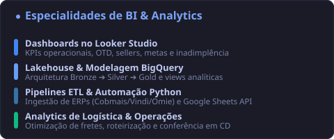

# 👋 Olá, eu sou o Rafael Ponciano!

### **📊 Analista de Dados & BI | Business Intelligence & Analytics no Peça.aí**

  
  
  
  

---

  Atuo como <b>Analista de Dados & BI</b> no <b>Peça.aí</b> (plataforma de logística e distribuição de autopeças B2M/B2C), transformando grandes volumes de dados brutos de e-commerce, logística de CD e financeiro em <b>modelos analíticos estruturados</b>, <b>dashboards executivos no Looker Studio</b> e <b>insights estratégicos para tomada de decisão</b>.

 

## 🎯 Especialidades & Áreas de Atuação

- 📊 **Business Intelligence & Dashboards Executivos:** Desenho, modelagem e sustentação de painéis analíticos no **Looker Studio**, monitorando KPIs críticos como *On-Time Delivery (OTD)* logístico, faturamento e margem de sellers, metas comerciais escalonadas (Meta 2 B2M), saúde e recorrência de carteira de clientes, e acompanhamento de inadimplência/recuperação de crédito.
- 🏛️ **Modelagem Dimensional & Lakehouse no BigQuery:** Estruturação e manutenção da arquitetura em medalhão (**Bronze ➔ Silver ➔ Gold**) no **Google BigQuery**, consolidando fatos de negócio (pedidos no grão item, compras, devoluções, fretes, financeiro) e criando views analíticas otimizadas para consumo de BI de alta performance.
- 🐍 **Engenharia de Dados & Pipelines de Automação (ETL):** Desenvolvimento de rotinas em **Python** (Pandas, BigQuery Client, Requests) para ingestão automatizada, higienização de bases cadastrais, integração com hubs de e-commerce (**AnyMarket**), gateways de pagamento/ERP (**Vindi**, **Cobmais**, **Omie**) e Google Sheets API.
- 🚚 **Analytics para Operações & Logística:** Inteligência voltada para centros de distribuição (CD): auditoria e empilhamento de pedidos para mitigação de custos de frete fixo, otimização de rotas para coleta de peças em oficinas e análise de causas-raiz de devoluções.

---

## 💻 Tech Stack & Ferramentas

  

| Domínio | Ferramentas & Tecnologias |
|:---|:---|
| **BI & Analytics** | Google Looker Studio, Google Cloud Platform (GCP), Google BigQuery, Google Sheets API |
| **Modelagem & Banco de Dados** | SQL Avançado (Window Functions, CTEs), PostgreSQL, Supabase, SQLite |
| **Engenharia & Automação** | Python (Pandas, NumPy, BigQuery SDK), REST APIs, FastAPI, Flask, Webhooks |
| **DevOps & Versionamento** | Git, GitHub, Linux / Bash, Docker |

---

## 📊 Visão Geral de Competências & Linguagens

<table border="0" width="100%" cellpadding="0" cellspacing="0">
  <tr>
    <td width="50%" align="center" style="border: none; padding: 6px;">
      
    </td>
    <td width="50%" align="center" style="border: none; padding: 6px;">
      
    </td>
  </tr>
</table>

---

## 🚀 Projetos & Entregas em Destaque

### 🏢 **Corporativo — Peça.aí (Logística, Dados & BI)**

| Projeto | Escopo | Descrição Técnica & Impacto |
|:---|:---|:---|
| **Plano Diretor BigQuery** | Data Lakehouse & BI | Migração de pipelines analíticos para a arquitetura Bronze ➔ Silver ➔ Gold no BigQuery (`pecai-prod`), alimentando dashboards corporativos de vendas, OTD e finanças no Looker Studio. |
| **Central ETL** | Ingestão & Automação | Plataforma central em Python para sincronização de dados entre Omie ERP, Vindi, Cobmais, AnyMarket, Google Sheets e GCP. |
| **App Recebimento CD** | WMS & Operações | Sistema desktop/web para conferência de mercadorias no CD, locks de concorrência e expedição por leitor óptico (DANFE 44 dígitos). |

 

### 💡 **Iniciativas Pessoais & Produtos SaaS Autônomos**

| Projeto | Tipo | Descrição Técnica & Destaque |
|:---|:---|:---|
| **Caça-Leads** | Inteligência Comercial (B2B) | Motor autônomo de prospecção para venda de sites/sistemas com scoring bidimensional (Dor Técnica × Capacidade Financeira) e geração de relatórios de auditoria. |
| **BarberFlow Ultra v3.1** | SaaS Multi-Tenant | Plataforma de gestão para barbearias com fila ao vivo por profissional, painel de estoque, agendamentos e métricas em React 19 + Shadcn/UI + Supabase. |
| **Wall Street AI** | Terminal de Trading Cripto | Terminal quantitativo em React 19 + Three.js com motor de risco (Circuit Breaker) e execução na Binance Spot Testnet via HMAC-SHA256. |

---

  Transformando dados brutos em decisões operacionais e estratégicas de alto impacto. 📊🚀

